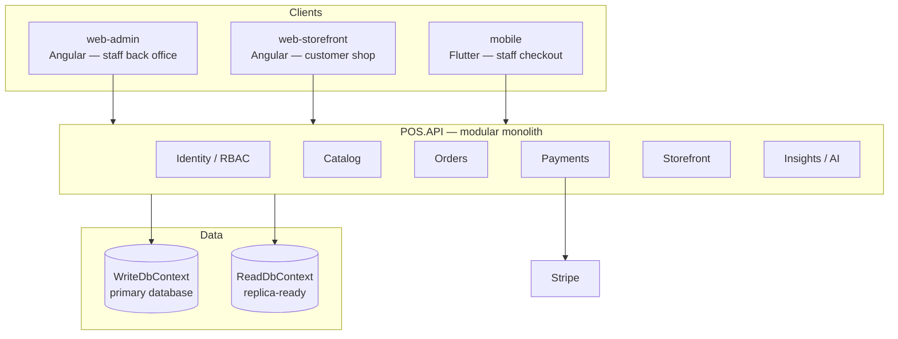

# AI-Powered POS — Project Plan & Progress Summary

**Repo:** https://github.com/MohamedSha3ban/pos-system-ai
**Status as of this document:** backend + two web portals + mobile staff app, modular monolith with real RBAC, Stripe payments, and a read/write database split.

This document is a retrospective plan: it traces the project from the original product plan through every implementation phase to the current architecture, and lays out what's still open.

---

## 1. Timeline of phases

| Phase | What was decided | What got built |
|---|---|---|
| **1. Product plan** | General-purpose POS (sellable to other businesses), web + mobile, AI woven through sales insights, inventory, and customer experience | A full written plan: personas, core modules, payment methods, AI integration points, tech stack, security/compliance, monetization, phased roadmap, team sizing |
| **2. Initial implementation** | Stack: ASP.NET Core 8 backend, Angular web, Flutter mobile | Clean Architecture backend (Domain/Application/Infrastructure/API), JWT auth, a payment orchestration abstraction (`IPaymentProcessor`), a moving-average AI forecasting baseline, one Angular app with login + POS checkout, one Flutter app mirroring it |
| **3. Pushed to GitHub** | — | Repo created and pushed via a scoped personal access token (no GitHub connector was available in the registry at the time) |
| **4. Modular architecture + migrations + Stripe + CRUD** | Restructure into bounded-context modules rather than flat layers; wire up real payments; give products/categories full CRUD | Domain/Application/Infrastructure reorganized into `Modules/{Identity, Catalog, Orders, Payments, Insights}`, each with its own DI registration; hand-authored EF Core migration (no NuGet access in this environment to run `dotnet ef` directly); real Stripe.net `PaymentIntent` calls + webhook receiver; full Products/Categories CRUD on both web and mobile |
| **5. Two portals: admin + storefront** | Split staff back-office from customer-facing shopping; add real roles/permissions and platform-level tenant management | `web-admin` (Users, Roles & Permissions, Tenants, Products, Categories, Inventory, POS checkout) and a brand-new `web-storefront` (public catalog, cart, customer accounts, self-checkout); backend gained a `Role`/`UserRoleAssignment` RBAC system, a `Permissions` code catalog, a `Storefront` module with its own customer identity, and `Order.Channel` (InStore/Online) to let one `OrderService` serve both staff and customer checkout |
| **6. Read/write database split** | Separate the data layer into a write side (primary) and a read side (replica-ready), reviewing every service individually rather than routing mechanically | `IWriteDbContext`/`WriteDbContext` and `IReadDbContext`/`ReadDbContext`, sharing one `PosModelConfiguration`; every Application service re-examined and assigned to whichever side preserves its consistency needs (checkout stays entirely on Write; independent list/report reads move to Read) |

---

## 2. Current architecture

**Backend module map:**

| Module | Owns | Notes |
|---|---|---|
| **Identity** | `Tenant`, `Location`, `User`, `Role`, `UserRoleAssignment` | Real RBAC: permission codes live in a fixed `Permissions` catalog; roles are tenant-scoped and hold a CSV of granted codes; every tenant is seeded with Owner/Manager/Cashier on signup. Platform-admin (cross-tenant) access is a separate `User.IsPlatformAdmin` flag, set manually in the DB — not self-service by design. |
| **Catalog** | `Category`, `Product`, `InventoryItem` | Full CRUD for products/categories; a dedicated `InventoryController` for stock-across-locations with reorder-point flagging. |
| **Orders** | `Customer`, `Order`, `OrderItem`, `Payment` | `OrderService.CreateOrderAsync` is shared by staff (in-store) and customer (online) checkout, distinguished by `Order.Channel` and a nullable `CashierUserId`. |
| **Payments** | `IPaymentProcessor` implementations | Cash, and real Stripe (`PaymentIntent`s) for card + wallets, plus a webhook receiver. Swappable per `PaymentMethod` without touching `OrderService`. |
| **Storefront** | Customer auth | Customers are a separate identity from staff `User`s — their own JWT (no permissions, scoped to one tenant), their own register/login endpoints, public (anonymous) catalog browsing. |
| **Insights** | AI forecasting | Baseline moving-average reorder suggestions today; the interface (`IForecastingService`) is designed to swap in a real model or an external ML service without changing callers. |

**Read/write split, in one sentence per service:**

| Service | Write context for | Read context for |
|---|---|---|
| `OrderService` | Everything — product/price/stock lookups AND the order write, in one consistent operation | *(never — checkout must never read a possibly-stale replica)* |
| `ProductService` / `CategoryService` / `InventoryService` | Create/Update/Delete | List/browse (catalog grids, inventory screen) |
| `UserService` / `RoleService` / `TenantService` | Create/Update/Delete/Deactivate | List screens |
| `AuthService` | Tenant registration (build response from what was just written) | Login (accepted lag trade-off) |
| `CustomerAuthService` | Registration (check-then-create must see its own check) | Login |
| `SimpleMovingAverageForecastingService` (AI) | *(never writes)* | Always — a heavier analytical scan with no reason to compete with checkout traffic |

---

## 3. What's built, portal by portal

### web-admin (staff / back-office)
Sidebar shell with permission-gated navigation:
- **POS checkout** — staff-assisted, in-store, split-tender support
- **Products / Categories** — full CRUD
- **Inventory** — stock across locations, inline adjustment, low-stock flagging
- **Users** — create/deactivate staff, assign roles
- **Roles & Permissions** — create custom roles, toggle permission checkboxes (system roles editable but not deletable)
- **Tenants** — platform-admin only, cross-tenant list + activate/deactivate

### web-storefront (public, customer-facing)
Standalone app with no knowledge of staff auth or the admin API surface: product grid → in-memory cart (Angular signals) → checkout, which prompts inline customer login/registration before placing the order. Currently serves **one tenant per deployment** (hardcoded `tenantId` in `environment.ts`) — real multi-tenant routing by subdomain is a noted next step.

### mobile (Flutter, staff)
Unchanged since phase 4: login, POS checkout, Products/Categories CRUD. Was **not** extended with the RBAC/Tenants/Inventory screens or turned into a second storefront app — a deliberate scope decision to keep each pass focused, called out explicitly rather than silently skipped.

---

## 4. Key trade-offs made along the way

- **Modular monolith, not microservices.** One shared database/deployment unit with clean module boundaries in code (own DI registration, own DbSets touched) — cheaper to run, and any module can still be extracted into its own service later with limited rewiring.
- **Hand-authored EF Core migrations.** This sandbox has no network access to NuGet, so `dotnet ef migrations add` can't run here. Migrations were hand-written to match the model exactly, but the `.Designer.cs`/snapshot files EF's tooling normally generates are intentionally absent — flagged clearly in-file and in the README rather than faked.
- **Permissions as a fixed code catalog + CSV column**, not a fully normalized `Permission` table with a join. The permission set is small, fixed by the app's capabilities, and read far more than written — a CSV column on `Role` avoids a third RBAC table for no real benefit at this scale.
- **Platform-admin access is a boolean flag, not an API.** Deliberately not self-service; seeded with a raw SQL statement documented in the README.
- **Storefront tenant resolution is a hardcoded config value**, not subdomain-based. Correct for a single-tenant deployment; flagged as the thing to fix before this could serve multiple businesses from one storefront deployment.
- **Read replica is architecturally real but not physically provisioned.** Both connection strings point at the same local database today — the code path, consistency reasoning, and connection-string plumbing are all in place; a production deployment just needs to point `Read` at an actual replica host.

---

## 5. Open next steps

1. Run `dotnet ef migrations add InitialCreate --context WriteDbContext` locally (once packages can be restored) to get a tooling-verified migration.
2. Provision a real Postgres read replica and point the `Read` connection string at it.
3. Seed a platform admin and confirm the Tenants screen end-to-end.
4. Wire up real Stripe Elements (web) / `flutter_stripe` (mobile) client-side card collection — both checkout flows currently pick a payment method but don't collect real card details yet.
5. Resolve storefront tenant by subdomain/custom domain for true multi-tenant storefront hosting.
6. Extend the Flutter app with the Users/Roles/Tenants/Inventory screens, or build a Flutter storefront app mirroring `web-storefront`.
7. Real tax engine, refunds/voids, regional payment rails (QR/bank transfer, BNPL).
8. The LLM-based "ask your data" natural-language reporting feature from the original plan — not yet started.
